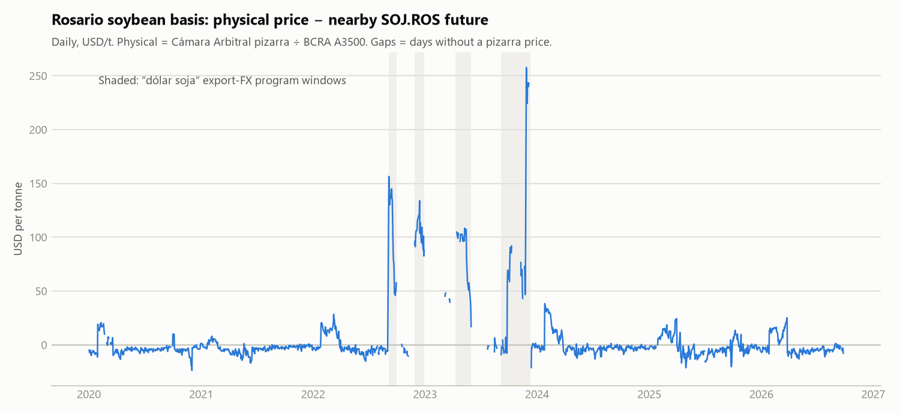
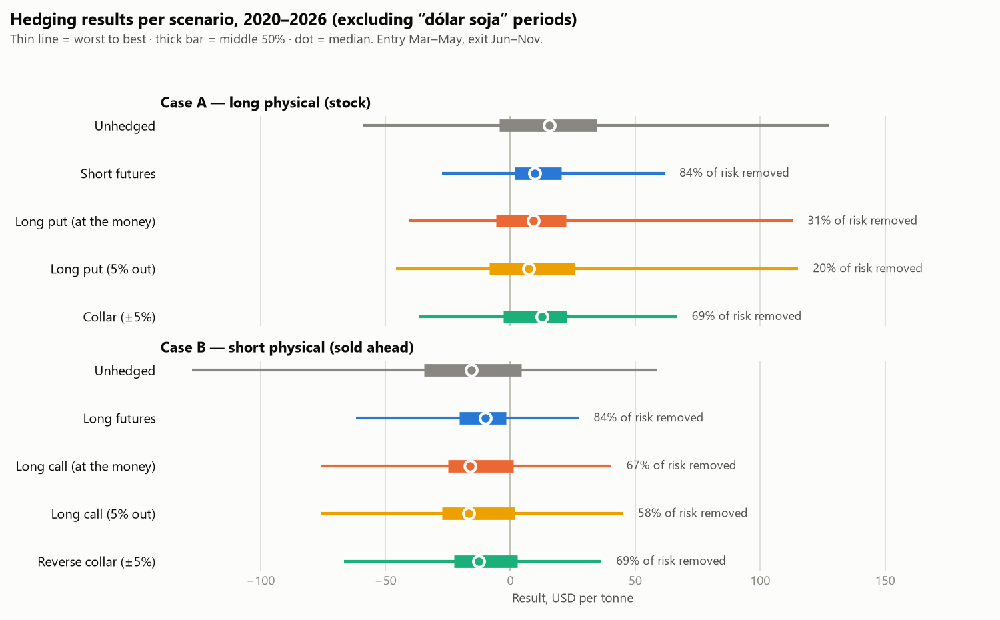

# CoberturasAgro — ¿Le convino cubrirse a un acopio de soja de Rosario?

*[English version](README.en.md) (traducción del original en español)*

## Resumen

Backtest de cómo podría haberse cubierto un acopio de soja de Rosario con futuros y opciones de
A3 Mercados, con datos diarios de mercado de 2020 a 2026 (6 campañas, 90 escenarios en la
muestra principal).

- **Los futuros eliminaron alrededor del 84% del riesgo de precio** (intervalo del 95%: 74–90%).
  Para un acopio con mercadería en stock, el peor resultado pasó de −59 a −27 USD/tn.
- **Las opciones protegieron mucho menos:** comprar un put eliminó alrededor del 31% de la
  varianza y comprar un call, alrededor del 67%. Conservan parte de la suba, pero la prima es cara.
  Un collar (comprar un put 5% por debajo del futuro y vender un call 5% por encima) eliminó el
  69% casi sin costo, todavía por debajo de los futuros.
- **Guardar mercadería cubierta capturó la recuperación de la base:** +12,8 USD/tn en promedio
  (intervalo de +7 a +17), antes de costos de almacenaje y financiación. Equivale a cerca de un
  12% anual en dólares: el nivel de costo a partir del cual guardar deja de convenir.
- **La cobertura falló durante el dólar soja (2022–2023):** eliminó apenas entre 0 y 10% del
  riesgo, porque el precio físico incluía un tipo de cambio especial y el futuro no.
- **Cubrir alrededor de 1,3 toneladas de futuros por tonelada** da un poco mejor fuera de muestra
  (87% contra 81%), pero la mejora no es estadísticamente robusta.

Todo se reproduce con fuentes públicas, sin rellenar datos faltantes y con 141 tests que corren
sin conexión. Los límites (seis campañas, primas de opciones que en su mayoría son valuaciones de
ajuste y no operaciones, sin comisiones ni costo financiero) están aclarados junto a cada resultado.

## La pregunta

### El problema del acopio

Un acopio de la zona de Rosario le compra soja a los productores en la cosecha (marzo a mayo),
la guarda en sus silos y la vende meses después. Entre la compra y la venta tiene mercadería
cuyo precio puede bajar. Ese es su **riesgo de precio**.

El precio con el que opera es el **precio pizarra de la Cámara Arbitral de Rosario**, el precio de
referencia de la soja disponible en Rosario. Se mueve con el precio internacional de la soja y,
en Argentina, también con el tipo de cambio, las retenciones y los programas cambiarios
especiales.

**Ejemplo.** En abril el acopio compra 1.000 toneladas a 300 USD/tn y piensa venderlas en
septiembre. Si para septiembre la pizarra bajó a 260 USD/tn, pierde 40 USD/tn: 40.000 dólares.

### Cómo se puede cubrir

En A3 Mercados (ex Matba-Rofex) se negocian futuros y opciones sobre soja con entrega en Rosario.

- **Futuro:** en abril, el acopio *vende* un futuro de soja a, por ejemplo, 305 USD/tn. Si en
  septiembre el precio cayó y el futuro vale 265, recompra el futuro y gana 40 USD/tn. Esa
  ganancia compensa lo que perdió con la soja guardada. Si el precio sube, pasa lo contrario:
  gana con la soja y pierde con el futuro. En los dos casos el resultado queda casi fijo.
- **Opción de venta (put):** funciona como un seguro. El acopio paga una prima y, si el precio
  baja, la opción compensa la caída. Si el precio sube, no pierde nada con la opción (solo la
  prima) y se queda con la suba.
- **Collar:** compra un put y, para pagarlo, vende una opción de compra (call). Queda protegido
  contra bajas fuertes, pero renuncia a las subas fuertes.

La cobertura nunca es perfecta. El futuro sigue al precio de la soja, pero no es exactamente la
pizarra de Rosario del día. La diferencia entre los dos se llama **base**, y lo que la base se
mueve entre la compra y la venta es un riesgo que la cobertura no elimina.

También existe el acopio en la situación inversa. Recibió soja "a fijar" (el productor decide
más adelante en qué día fija el precio) y, para liberar espacio, ya la vendió a precio fijo. Si
el precio **sube** antes de que el productor fije, tiene que pagarle más de lo que cobró. Ese
acopio se cubre comprando futuros o calls. El proyecto analiza los dos casos.

### Qué se busca responder

**Si un acopio se hubiera cubierto entre 2020 y 2026, ¿cuánto riesgo le habría sacado cada
estrategia, cuánto le habría costado y en qué situaciones no le habría servido?**

Para responderlo se simula, con precios reales de cada día, qué habría pasado en cada campaña:

1. **Base:** cuánto se separa el precio de Rosario del futuro y cuándo. Eso marca el límite de
   lo que una cobertura puede lograr.
2. **Backtest:** el resultado de cada estrategia (sin cobertura, futuros, opciones, collar) en
   90 combinaciones de fecha de compra y fecha de venta.
3. **Riesgo, no solo promedio:** el peor resultado, cuánto varían los resultados y cuánto
   cuesta la prima de las opciones.

## Datos

| Fuente | Qué trae | Cobertura | Módulo |
|---|---|---|---|
| Cámara Arbitral de Rosario (BCR) | Precio pizarra diario de soja, ARS/tn | 2015 → hoy | `src/coberturas/data/pizarra.py` |
| API del BCRA v4 (variable 5) | Tipo de cambio mayorista, Com. A 3500 | 2015 → hoy | `src/coberturas/data/fx.py` |
| API pública de A3 Mercados | Ajustes de futuros SOJ.ROS (USD/tn) y primas de opciones por strike | 2020 → hoy (no hay datos anteriores) | `src/coberturas/data/a3.py` |
| Yahoo Finance `ZS=F` | Soja CBOT, contrato más cercano (solo como referencia) | 2015 → hoy | `src/coberturas/data/cbot.py` |

- **El backtest arranca en 2020** porque la API de A3 no tiene datos anteriores. Eso da unas
  seis campañas de soja.
- **Los días sin precio pizarra ("S/C", sin cotización)** quedan como faltantes explícitos y
  nunca se rellenan. Solo en 2023 hubo 144, durante los programas de dólar soja.

## La base (`src/coberturas/analisis/base.py`)

<picture>
  <source media="(prefers-color-scheme: dark)" srcset="docs/img/base_dark.png">
  
</picture>

**Base = precio físico de Rosario (pizarra ARS/tn ÷ A3500 del BCRA del mismo día) − ajuste del
futuro SOJ.ROS de A3 (USD/tn).** El contrato de referencia es el mes líquido más cercano (enero,
mayo, julio, septiembre o noviembre, que concentran casi todo el volumen).

- **El futuro converge al precio físico.** En los últimos tres días de mercado de cada contrato
  vencido, la base en períodos normales tiene una mediana de **−4,1 USD/tn** (la mitad central,
  entre −6,2 y −2,6; 29 contratos). Esto confirma además que el A3500 es la conversión correcta.
- **En años normales la base es chica y estable:** alrededor de −3 USD/tn, con movimientos
  diarios de 4 a 9 USD/tn. Por eso la cobertura con futuros funciona bien: casi todo el riesgo
  de precio está en el precio del futuro.
- **Es estacional.** La base está más débil en cosecha (abril a julio, alrededor de
  −6 USD/tn) y después se recupera. Un acopio que compra en cosecha y vende más tarde captura
  esa recuperación; el backtest de abajo la mide.
- **Se rompe durante el dólar soja.** Los desvíos de más de 30 USD/tn se concentran en
  septiembre 2022, noviembre–diciembre 2022, marzo–mayo 2023 y septiembre 2023 a febrero 2024.
  Durante el Programa de Incremento Exportador la pizarra en pesos incorporaba un tipo de cambio
  especial y el futuro no.

## Backtest de coberturas (`src/coberturas/analisis/cobertura.py`)

### Los dos casos del acopio

Según el material de capacitación de la Bolsa de Comercio de Rosario sobre acopios, el acopio
cubre su **posición neta expuesta**, que puede estar de cualquiera de los dos lados:

- **Caso A: comprado en el disponible.** Compró soja "a precio" y la tiene en stock. Pierde si
  el precio baja. Cobertura: vender futuros o comprar un put.
- **Caso B: vendido en el disponible.** Recibió soja "a fijar" (el productor fija el precio más
  adelante) pero ya la vendió "a precio" para liberar espacio en los silos. Pierde si el precio
  sube antes de que el productor fije. Cobertura: comprar futuros o comprar un call.

**Escenarios:** entrada a fin de marzo, abril o mayo (ingreso de cosecha) y salida a fin de
cualquier mes entre junio y noviembre (cuando los productores fijan precio). Son 18 escenarios
por campaña, de 2020 a 2026. Los resultados están en USD por tonelada, con una tonelada cubierta
por cada tonelada física.

**Contrato de cobertura:** el mismo para futuros y opciones, para que la comparación sea justa.
Es el primer contrato SOJ.ROS de mayo, julio o noviembre que venza al menos dos meses después de
la salida, porque las opciones vencen alrededor de un mes antes que su futuro y solo esos tres
meses tienen opciones con liquidez. Las opciones se compran en el dinero, a la prima de ajuste
del día de entrada, y se venden a la prima de ajuste del día de salida.

### Resultados: muestra principal (sin los meses del dólar soja)

<picture>
  <source media="(prefers-color-scheme: dark)" srcset="docs/img/estrategias_dark.png">
  
</picture>

90 escenarios, 6 campañas, USD por tonelada. *Riesgo eliminado* = porcentaje de la varianza sin
cobertura que la cobertura elimina. Los intervalos del 95% salen de un bootstrap que remuestrea
campañas enteras.

| | Promedio | Peor caso | Desvío | Riesgo eliminado | Intervalo 95% |
|---|---:|---:|---:|---:|---:|
| **A** sin cobertura | +19,6 | −59,0 | 42,0 | — | |
| **A** venta de futuros | +12,8 | −27,4 | 16,6 | **84%** | 74–90% |
| **A** compra de put | +13,2 | −40,6 | 31,1 | 31%\* | 18–56% |
| **A** compra de put 5% fuera del dinero | +13,5 | −45,8 | 33,6 | 20%\* | 10–38% |
| **A** collar (±5%) | +12,1 | −36,4 | 21,0 | 69%\* | 54–82% |
| **B** sin cobertura | −19,6 | −127,3 | 42,0 | — | |
| **B** compra de futuros | −12,8 | −61,7 | 16,6 | **84%** | 74–90% |
| **B** compra de call | −14,5 | −75,7 | 23,3 | 67%\* | 46–78% |
| **B** compra de call 5% fuera del dinero | −15,0 | −75,7 | 25,9 | 58%\* | 28–74% |
| **B** collar inverso (±5%) | −12,1 | −66,6 | 21,0 | 69%\* | 54–82% |

\* Las filas de opciones usan los escenarios en los que la opción ya cotizaba al momento de
entrar (entre 86 y 88 de 90). Si se comparan todas las estrategias sobre exactamente los mismos
escenarios, el resultado es el mismo.

**Qué muestra**

1. **El futuro elimina la mayor parte del riesgo de precio:** el 84% de la varianza, y el 87%
   fuera del período del dólar blend (2023–2025). El peor resultado del acopio comprado mejora de
   −59 a −27 USD/tn.
2. **Lo que queda después de cubrirse con futuros es la base, y al acopio comprado le dio
   ganancia: +12,8 USD/tn en promedio.** Es la recuperación de la base después de la cosecha, lo
   que el mercado paga por almacenar. El acopio vendido (caso B) paga ese mismo monto.
3. **Las opciones quedan en el medio.** Conservan parte de la ganancia si el precio se mueve a
   favor, pero la prima las hace más caras y bastante menos completas como cobertura, sobre todo
   el put.
4. **Los promedios sin cobertura no son un resultado estructural.** Reflejan sobre todo las
   subas de precio de 2020 y 2025 en una muestra de solo seis campañas.

### Opciones fuera del dinero y collar (`src/coberturas/analisis/collar.py`)

Mismos escenarios, mismo contrato y misma regla de primas que arriba. El **put 5% fuera del
dinero** es el de strike listado más cercano al 95% del futuro del día de entrada; el **call 5%
fuera del dinero**, el más cercano al 105%. Si el strike más cercano se aleja más de 2 puntos
porcentuales de ese objetivo, la pata queda como no disponible, en lugar de usar otro strike sin
avisar. El **collar** del caso A compra ese put y vende ese call; el **collar inverso** del caso B
compra el call y vende el put.

- **El collar eliminó el 69% del riesgo, mucho más que un put solo (31% en el dinero, 20% fuera
  del dinero), y casi no costó nada:** el call vendido valía un poco más que el put comprado, así
  que el acopio cobró alrededor de 1 USD/tn al entrar (mediana). Su resultado promedio
  (+12,1 USD/tn) es parecido al de la cobertura con futuros (+12,8).
- **El futuro sigue protegiendo mejor.** Su peor caso es −27 USD/tn, contra −36 del collar y −46
  del put fuera del dinero. El collar solo tiene sentido para un acopio dispuesto a asumir
  movimientos de precio de hasta 5% para cualquier lado.
- **La varianza cuenta las ganancias como riesgo.** Un put sirve justamente para quedarse con la
  suba, y esa suba aumenta la varianza, así que el "riesgo eliminado" subestima para qué sirve un
  put. Para comparar opciones es más justo mirar el peor caso, y la conclusión es la misma.
- **El ancho de la banda importa de forma coherente.** Cuanto más ancha, menos protección:

| Distancia del strike | Escenarios | A: put fuera del dinero | A: collar | B: call fuera del dinero | B: collar inverso |
|---|---:|---:|---:|---:|---:|
| 3% | 76 | 25% | 77% | 62% | 77% |
| 5% | 86 | 20% | 69% | 55% | 69% |
| 10% | 78 | 10% | 55% | 46% | 55% |

  Cada fila compara todas las estrategias sobre los mismos escenarios; por eso la fila del 5%
  puede diferir un poco de la tabla principal. La cantidad de escenarios cambia porque no
  siempre hay un strike listado lo bastante cerca de cada objetivo.

**Advertencia sobre la liquidez.** A3 publica una prima de ajuste para cada strike listado,
aunque ese día no se haya operado. El día de entrada, el put 5% fuera del dinero tuvo operaciones
en solo 6 de 28 posiciones y el call en 12 de 29 (el día de salida: 9 de 60 y 23 de 69), aunque
todas tenían interés abierto. **La mayoría de estas primas son la valuación del mercado, no
precios a los que alguien efectivamente operó**, así que los resultados con opciones y collar son
menos confiables que los de futuros. Además, vender el call exige margen, cuyo costo financiero no
se incluye. En los meses del dólar soja el collar falló como todas las coberturas (eliminó
alrededor del 9% del riesgo).

**Put sintético.** Un curso de la Bolsa de Comercio de Rosario sobre estrategias de cobertura
(Cavarozzi, 2026) recomienda el *put sintético* (vender un futuro y comprar un call del mismo
strike) cuando los calls tienen más liquidez que los puts, algo habitual en el mercado local.
Los datos coinciden en la liquidez: los calls fuera del dinero de arriba se operaron alrededor
del doble de veces que los puts. Para ver si la elección cambia la cobertura hay dos controles:

- **La paridad put-call se cumple en las primas de ajuste de A3 en cada día:** en unos 15.000
  pares call/put con strikes a menos del 5% del futuro (2020–2026), C − P − (F − K) tiene una
  mediana de 0,0 USD/tn y el 90% de los pares queda dentro de ±2 USD/tn.
- **En los períodos reales de cobertura, las dos terminan cerca pero no son idénticas.** En los
  64 escenarios de la muestra principal en los que había un call del strike del put en las dos
  fechas, el put sintético se diferenció del put en 1,0 USD/tn de mediana (el 90% de los
  escenarios dentro de 3,7 USD/tn, como máximo 5,5). La diferencia es el cambio del desvío de
  paridad entre la entrada y la salida. La protección es casi la misma: 41% del riesgo eliminado
  contra 38% del put en esos mismos escenarios, con peores casos parecidos (−40,6 y −40,1 USD/tn). En los otros
  22 escenarios no había un call listado con el strike del put el día de entrada.

En esta muestra, elegir entre un put y un put sintético depende de la liquidez y las comisiones,
no de la protección.

### Robustez (`src/coberturas/analisis/robustez.py`)

**Intervalos de confianza.** Con solo seis campañas, y 18 escenarios muy correlacionados dentro
de cada una, un número como "84%" aparenta más precisión de la que tiene. Los intervalos de la
tabla de arriba remuestrean campañas enteras (5.000 veces), así que muestran cuánto depende el
resultado de qué años tocaron en la muestra. La cobertura con futuros sigue siendo claramente
efectiva (74–90%) y le gana con claridad al put (18–56%); contra el call (46–78%) los intervalos se
superponen un poco. La ganancia de base promedio del acopio comprado (+12,8 USD/tn) tiene un
intervalo de +7 a +17 USD/tn, entero por encima de cero.

**¿Cubrirse 1 a 1 es el tamaño correcto?** La referencia estándar en la literatura es el *ratio
de cobertura de mínima varianza* (Ederington, 1979): cuántas toneladas de futuros por tonelada
física minimizan la varianza de la posición cubierta. Se estima **fuera de muestra**: el ratio que
se aplica en cada campaña se calcula solo con campañas anteriores, que ya habían terminado cuando
el acopio entra en marzo.

| Campañas 2021–2026 (72 escenarios) | Riesgo eliminado | Peor caso |
|---|---:|---:|
| 1 a 1 | 81% | −27,4 |
| Ratio de mínima varianza, fuera de muestra | 87% | −23,1 |

- **El ratio estimado ronda 1,3 y es muy estable** (entre 1,27 y 1,41 según la campaña). El precio
  físico se movió alrededor de un 45% más que el futuro de cobertura (desvío de 34 contra
  24 USD/tn). Es lo esperable, porque la cobertura usa contratos lejanos (noviembre o el mayo
  siguiente), y los futuros lejanos son menos volátiles que el precio disponible (el "efecto
  Samuelson").
- **Pero la mejora no es robusta.** El ratio de 1,3 le gana al 1 a 1 en 2024–2026 y pierde en
  2021–2022, y la mayor parte de la ganancia viene de 2025. El intervalo del 95% de la mejora va de
  −1 a +8 puntos porcentuales e incluye el cero. Coincide con Wang, Wu y Yang (2015), que
  encuentran que los ratios estimados rara vez le ganan de forma confiable al 1 a 1 fuera de
  muestra.
- **Lectura práctica:** cubrirse algo más que 1 a 1 cuando se usan contratos lejanos es razonable,
  pero los datos no alcanzan para recomendar un ratio preciso.

Los intervalos mantienen fijos los ratios estimados, así que no incluyen la incertidumbre de
volver a estimarlos. Además miden la varianza sobre escenarios superpuestos agrupados, no los
resultados anuales de una cartera real.

### ¿Conviene almacenar? Punto de equilibrio del almacenaje y la financiación

Los +12,8 USD/tn son **antes de los costos de almacenaje y financiación**. No hay una fuente
pública confiable con tarifas de almacenaje ni tasas de financiación actuales de los acopios,
así que en lugar de suponerlas el backtest informa el **punto de equilibrio**: el costo que
llevaría a cero el resultado de cada escenario.

| Muestra principal (90 escenarios) | Percentil 25 | Mediana | Percentil 75 |
|---|---:|---:|---:|
| Ganancia de base por mes de almacenaje (USD/tn por mes) | 0,7 | **2,8** | 4,8 |
| La misma ganancia como tasa anual simple en USD sobre el valor de la soja | 2% | **12%** | 21% |

- La posición cubierta ganó plata en el **82%** de los escenarios antes de costos. Habría
  cubierto un costo de almacenaje más financiación de **2 USD/tn por mes en el 58%** de ellos, y
  de 3 USD/tn por mes en el 48%.
- **En términos financieros:** en el escenario mediano, guardar soja cubierta rindió cerca del
  12% anual en dólares sobre el capital inmovilizado en granos. Si el costo de fondeo más el
  almacenaje del acopio está por debajo de eso, guardar mercadería cubierta convenía.
- Las salidas de octubre y noviembre se cubren con el contrato de mayo del año siguiente
  (cosecha nueva), así que su ganancia mayor incluye la diferencia entre cosecha vieja y nueva y
  no se puede comparar directamente con las salidas de junio a septiembre.

### Los meses del dólar soja, aparte

24 escenarios de 2022–2023 cuyo período de tenencia se superpone con alguna ventana del Programa
de Incremento Exportador. **Acá la cobertura dejó de funcionar: eliminó apenas entre el 0 y el
10% del riesgo.** La pizarra en pesos incluía el tipo de cambio especial y los futuros de A3 no,
así que se rompió la relación entre el precio físico y el futuro. El acopio vendido y cubierto
con futuros (caso B) perdió en promedio 43 USD/tn, con un peor caso de −203 USD/tn. **El futuro
te cubre de los movimientos de precio, no de un cambio en las reglas cambiarias.**

Es un caso argentino de un fenómeno muy estudiado en Estados Unidos: la **falta de convergencia**,
cuando el precio físico en el punto de entrega deja de seguir al futuro. Adjemian, Garcia, Irwin y
Smith (2013) lo documentan en maíz, soja y trigo de EE.UU. entre 2005 y 2010. Goswami, Karali y
Adjemian (2023) muestran que en esos períodos el futuro pierde buena parte de su valor como
cobertura, sin importar qué ratio se use. La diferencia es la causa: acá vino de una regulación
cambiaria, no de la economía del almacenaje.

| Régimen | Fechas | Fuente |
|---|---|---|
| PIE I | 05/09/2022 → 30/09/2022 | Decreto 576/2022 |
| PIE II | 28/11/2022 → 30/12/2022 | Decreto 787/2022 |
| PIE III | 10/04/2023 → 31/05/2023 | Decreto 194/2023 |
| PIE IV y prórrogas | 05/09/2023 → 10/12/2023 | Decretos 443, 492, 549 y 597/2023 |
| Dólar blend 80/20 | 13/12/2023 → 14/04/2025 | Decreto 28/2023, derogado por el 269/2025 |

El período del blend está marcado, pero queda dentro de la muestra principal porque durante
2024 la base se mantuvo normal.

### Limitaciones

- **Muestra chica:** seis campañas, y los 18 escenarios de una misma campaña están muy
  correlacionados.
- **Los resultados no incluyen costos:** quedan afuera las comisiones y la financiación de
  márgenes y primas; el almacenaje y la financiación de la mercadería se tratan con el punto de
  equilibrio de arriba.
- **Regla mensual retrospectiva:** si el último día de mercado del mes no tiene precio, se usa
  el día anterior, algo que solo se puede saber después.
- **Relación de cobertura: 1 a 1 en los resultados principales**; el ratio de mínima varianza se
  prueba aparte. **Una sola regla de strike (en el dinero).**

## Decisiones metodológicas

1. **Quien se cubre: un acopio**, en sus dos posiciones netas posibles (comprado y vendido en el
   disponible).
2. **Pizarra convertida a dólares con el A3500 del BCRA** del mismo día.
3. **Sin aproximaciones silenciosas:** los precios faltantes quedan como faltantes, y un dato
   inválido o ambiguo detiene el código en lugar de adivinarse.
4. **Vencimiento de contratos inferido de los datos:** un contrato cuenta como vencido solo si
   dejó de cotizar dentro de su mes de entrega o después. No hay un calendario oficial
   descargable.
5. **Los meses del dólar soja se informan aparte**, con fechas tomadas de los decretos.

## Trabajos relacionados

- **Ederington (1979)**, *The Hedging Performance of the New Futures Markets*, Journal of Finance:
  el ratio de mínima varianza y la medida de "riesgo eliminado" que usa este proyecto.
- **Wang, Wu y Yang (2015)**, [*Hedging with Futures: Does Anything Beat the Naïve Hedging
  Strategy?*](https://pubsonline.informs.org/doi/10.1287/mnsc.2014.2028), Management Science: fuera
  de muestra es difícil ganarle al 1 a 1. Este proyecto llega a la misma conclusión.
- **Adjemian, Garcia, Irwin y Smith (2013)**, [*Non-Convergence in Domestic Commodity Futures
  Markets*](https://ers.usda.gov/sites/default/files/_laserfiche/publications/43777/39376_eib115.pdf),
  USDA ERS.
- **Goswami, Karali y Adjemian (2023)**, [*Hedging with futures during nonconvergence in commodity
  markets*](https://www.sciencedirect.com/science/article/pii/S2405851323000545), Journal of
  Commodity Markets: el antecedente más cercano al hallazgo del dólar soja.
- **Gorostiaga (2017)**, [*Caracterización de la curva de futuros de soja…: Rosario y
  Chicago*](https://repositorio.utdt.edu/items/34cd5eeb-a536-49d2-ad23-7830d2afafe4), tesis de
  maestría, Universidad Torcuato Di Tella: la curva de futuros de Rosario. No analiza la base ni
  las coberturas.

No se encontró ningún proyecto público que haga un backtest de coberturas de un acopio con
futuros y opciones de A3 Mercados contra el precio físico de Rosario.

## Fuentes

- Datos de precios: [Cámara Arbitral de Cereales de Rosario](https://www.cac.bcr.com.ar/es/precios-de-pizarra/consultas),
  [API de estadísticas del BCRA](https://api.bcra.gob.ar/estadisticas/v4.0/Monetarias/5),
  API pública de A3 Mercados que usa [cem.matbarofex.com.ar](https://cem.matbarofex.com.ar/),
  [Yahoo Finance ZS=F](https://finance.yahoo.com/quote/ZS=F).
- Estrategias de cobertura y opciones sintéticas: Cavarozzi, F., *Estrategias de cobertura con
  futuros y opciones agrícolas* (2026), diapositivas de un curso de la Bolsa de Comercio de Rosario
  (no están publicadas).
- Cómo opera un acopio: Landrein, [*Acopios*](https://www.bcr.com.ar/sites/default/files/2018-10/acopio.pdf),
  y Rosa, [*Acopios: ¿mayor giro o mayor almacenamiento?*](https://www.capacitacion.bcr.com.ar/Documentos/EdicionesBCR/5/acopio_rossa.pdf)
  (2001), material de capacitación de la Bolsa de Comercio de Rosario.
- Fechas de los regímenes: decretos [576/2022](https://www.boletinoficial.gob.ar/detalleAviso/primera/270972/20220905),
  [787/2022](https://www.boletinoficial.gob.ar/detalleAviso/primera/276571/20221128),
  [194/2023](https://www.boletinoficial.gob.ar/detalleAviso/primera/284120/20230410),
  [443/2023](https://www.boletinoficial.gob.ar/detalleAviso/primera/293431/20230905),
  [492/2023](https://www.boletinoficial.gob.ar/detalleAviso/primera/295254/20231002),
  [597/2023](https://www.argentina.gob.ar/normativa/nacional/decreto-597-2023-393336/texto) y
  [28/2023](https://servicios.infoleg.gob.ar/infolegInternet/anexos/395000-399999/395255/norma.htm).

## Cómo correrlo

```bash
python -m venv .venv
.venv/Scripts/python -m pip install -r requirements.txt   # venv de Windows
.venv/Scripts/python -m pytest -q                         # tests sin conexión
.venv/Scripts/python scripts/graficos.py                  # descarga los datos y regenera los gráficos
.venv/Scripts/python scripts/resultados_collar.py         # imprime las tablas del collar
```

Las descargas crudas quedan en caché en `data/raw/`, que no se versiona.

## Licencia

[MIT](LICENSE). Los datos no se redistribuyen: cada fuente mantiene sus propias condiciones.
